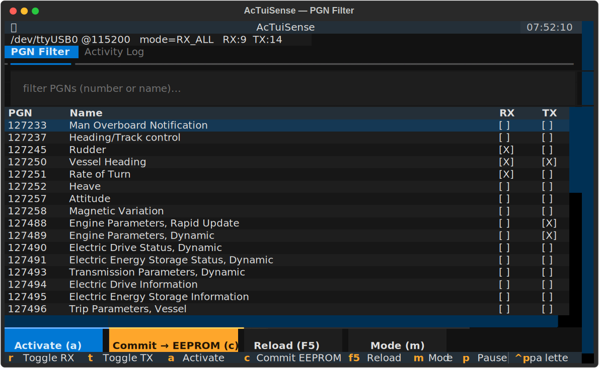
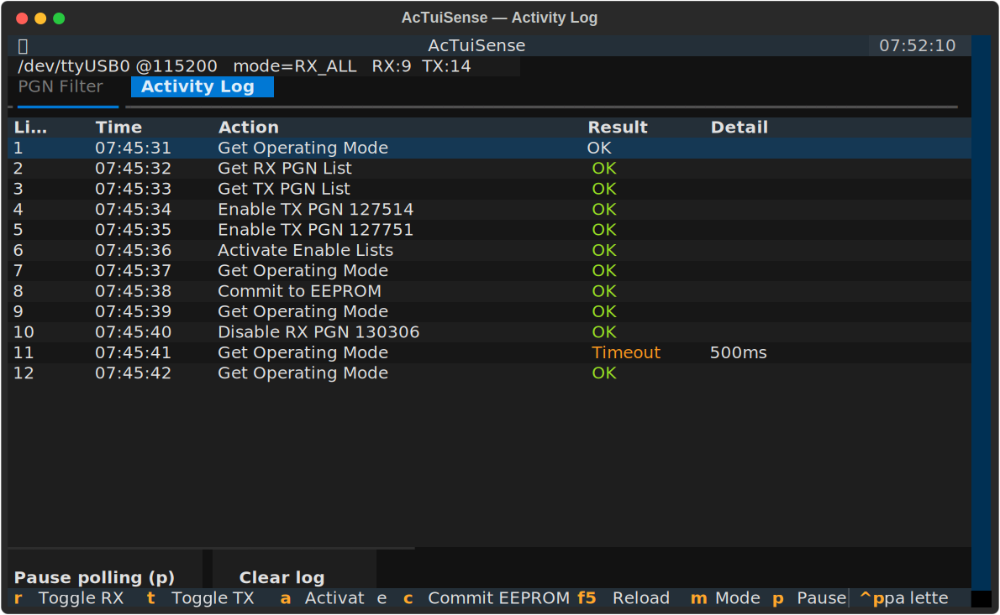

# AcTuiSense

A cross-platform **terminal UI to configure Actisense NMEA 2000 gateways**
(NGT-1, NGW-1, NGX-1) over a serial port or TCP — the open, scriptable alternative
to the Windows-only **Actisense NMEA Reader → Hardware Configuration**.

Runs anywhere Python runs: **Linux, macOS, and Windows (PowerShell / Windows
Terminal)**.



**Activity Log tab** — every gateway exchange (line, time, action, result, detail),
fed by a live Get-Operating-Mode poll plus your own actions, just like NMEA Reader's
command log:



> Validated end-to-end against a real **Actisense NGT-1** — reading the operating
> mode and Rx/Tx enable lists, toggling per-PGN filters, activating, and committing
> to EEPROM.

## Why

The NGT-1 will only **transmit** a PGN onto the bus if that PGN is in its **Tx PGN
Enable List**, and only **receives** the PGNs in its **Rx PGN Enable List** when in
Filter mode. By default these lists are minimal, so injected/forwarded application
PGNs are silently dropped. Actisense ships a Windows GUI to edit these lists;
AcTuiSense does the same job from any terminal, plus a plain CLI for automation.

> Heads-up: this writes to your gateway's configuration (and optionally its
> EEPROM). It is an independent project, **not affiliated with Actisense**. See
> [CREDITS.md](CREDITS.md) for protocol provenance.

## Install

```bash
# install straight from GitHub (recommended), with the WAGO/can0 extra:
pipx install "actuisense[wago] @ git+https://github.com/phobicdotno/actuisense.git"

# core only (serial / TCP gateway config, no can0 monitor):
pipx install "git+https://github.com/phobicdotno/actuisense.git"

# from a local checkout:
pipx install ".[wago]"          # or:  pip install -e ".[wago]"
```

Use `pip install --user "<same spec>"` instead of `pipx` if you prefer.
Requires Python ≥ 3.9, `pyserial`, and `textual` (plus `paramiko` for `[wago]`).

## Use

### TUI

```bash
actuisense tui                           # start disconnected, then pick a connection
actuisense tui -p /dev/ttyUSB0          # Linux/macOS serial
actuisense tui -p COM5                   # Windows
actuisense tui -p tcp://192.168.1.50:60002   # networked gateway (e.g. W2K-1)
```

Arrow keys / mouse to move, **space** toggles the RX or TX box on the focused PGN,
type in the filter box to narrow the list, then **Commit → EEPROM** to persist.

**Connection dialog** (`Ctrl+O`): choose the source without restarting — a serial
port (auto-detected ports are listed) + baud, a `tcp://` gateway, or a **WAGO PLC**.

### Bus Monitor — listen on a WAGO PLC's can0

A WAGO PFC200 on the same NMEA 2000 backbone exposes the bus as SocketCAN (`can0`).
Log in with a username/password over SSH and the **Bus Monitor** tab streams live
traffic straight off the wire — the ground truth for what the gateway is actually
transmitting. Pick *WAGO PLC (can0)* in the Connection dialog, or from the CLI:

```bash
actuisense monitor --host 10.0.0.202 -u root -P wago          # decoded can0 dump
actuisense monitor --host 10.0.0.202 -u root -P wago --iface can1 -n 50
```

Read-only: it never writes to the bus or the gateway. Needs the `wago` extra
(`pip install actuisense[wago]`, which adds paramiko).

### CLI (scriptable, no UI)

```bash
actuisense info        -p /dev/ttyUSB0           # hardware + operating mode + lists
actuisense enable  tx 127512 127514 127751 -p /dev/ttyUSB0 --commit
actuisense disable rx 130306 -p /dev/ttyUSB0
actuisense mode rxall  -p /dev/ttyUSB0           # or: filter
actuisense list tx     -p /dev/ttyUSB0
```

## Settings coverage

| Setting | CLI | TUI | Notes |
|---|---|---|---|
| Operating mode (Filter / Receive-All) | `mode` | `m` | the `0x11` command |
| Per-PGN **Rx** enable (all 339 PGNs) | `enable/disable rx` | `r` | `0x46` |
| Per-PGN **Tx** enable (all 339 PGNs) | `enable/disable tx` | `t` | `0x47` |
| Activate enable lists | implicit | `a` | `0x4B` |
| Commit to EEPROM (persist) | `--commit` | `c` | `0x01` |
| Read current Rx/Tx lists & mode | `info` / `list` | on connect | parsed |
| Raw diagnostic queries (hw/product/total-time) | `raw` | — | read-only hex; vendor-binary fields are **not** guessed |
| Activity log of every exchange (+ live poll) | — | Activity Log tab | line/time/action/result/detail; `p` pauses polling |
| Choose connection (serial/baud, TCP, WAGO) | `-p` / `monitor` | `Ctrl+O` | serial port auto-detect; start disconnected |
| Live can0 bus monitor (via WAGO PLC SSH) | `monitor` | Bus Monitor tab | read-only `candump`; per-PGN/source aggregation |

Deliberately **not** wired up yet: serial/CAN baud change, NMEA 0183 P-code, and
duplicate-filtering — these can disrupt the link, and their payloads are not
publicly specified, so they are left out rather than guessed. Device model/firmware
identification (via N2K PGN 126996) is a planned addition. The `protocol` module
already encodes the full Actisense command set, so adding these is straightforward
once each is verified against hardware.

## Status

Early but working: the protocol codec is validated against real NGT-1 captures
(see the tests). See [CHANGELOG.md](CHANGELOG.md) for what's wired up.

## License

MIT — see [LICENSE](LICENSE).
